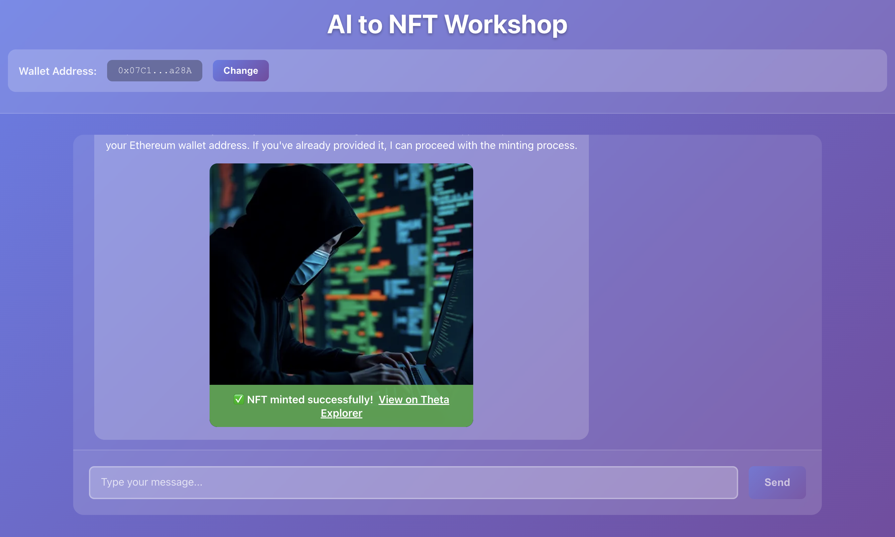

# 1. Introduction - Theta AI2NFT Workshop

Welcome to the **Theta AI2NFT Workshop**! 🎨🤖⛓️

In this hands-on workshop, you'll learn how to build a complete AI-powered NFT creation platform that seamlessly combines cutting-edge artificial intelligence with blockchain technology. By the end of this workshop, you'll have created a full-stack application that can generate images using AI and automatically mint them as NFTs on the Theta blockchain.

## 🚀 What You'll Build

You'll create an **AI to NFT Workshop** application that:
- **Generates images** from text prompts using state-of-the-art AI models
- **Processes conversations** with an intelligent AI assistant
- **Interact with the Theta Blockchain** Mints NFTs automatically from generated images



## 🛠️ Technologies We'll Use

### **Theta EdgeCloud** ([`thetaedgecloud.com`](thetaedgecloud.com))
- **LLM Integration**: Llama 3.1 70B Instruct for intelligent conversation handling
- **Image Generation**: Flux.1-schnell for creating stunning AI-generated artwork
- **Scalable AI Infrastructure**: Enterprise-grade AI models without the complexity

### **Theta Blockchain**
- **Smart Contracts**: Solidity-based NFT contracts for minting
- **Low-cost Transactions**: Fast and affordable NFT minting

### **Full-Stack Development**
- **Backend**: Node.js + Express + TypeScript for robust API development
- **Frontend**: React + TypeScript for a modern, responsive user interface
- **Integration**: RESTful APIs connecting AI services with blockchain functionality

## 📚 Workshop Structure & Learning Path

### **Primary Focus: Backend Development**
While we'll touch on all aspects of the application, **our main focus will be on backend development** - the brain of our AI2NFT platform.

### **Workshop Guides:**

#### **📖 Guide 1: Introduction** (This Guide)
- Workshop overview and technology introduction
- Learning objectives and prerequisites
- Repository structure and setup

#### **🔧 Guide 2: EdgeCloud Setup** ([`02-edgecloud-guide.md`](./02-edgecloud-guide.md))
- Setting up your Theta EdgeCloud account
- Understanding API authentication and endpoints
- Configuring your development environment

#### **💬 Guide 3: Chat Integration** ([`03-chat-integration-guide.md`](./03-chat-integration-guide.md))
- **LLM Integration**: Implementing Llama 3.1 70B Instruct for:
  - Intelligent conversation handling
  - Intent detection for image generation requests
- Backend API development for chat functionality

#### **🎨 Guide 4: Image Generation** ([`04-image-generation-guide.md`](./04-image-genearation-guide.md))
- **Image Generation**: Integrating Flux.1-schnell for:
  - Text-to-image generation
  - Prompt optimization and processing
  - Result handling
- Connecting image generation to the chat flow

#### **⛓️ Guide 5: Smart Contract Development** ([`05-smart-contract-guide.md`](./05-smart-contract-guide.md))
- **Solidity Fundamentals**: Understanding NFT contract structure
- **Wallet Creation**: Creating and managing a secure Theta wallet for contract interaction
- **Contract Deployment**: Step-by-step deployment to Theta testnet

#### **🪙 Guide 6: NFT Minting** ([`06-nft-minting-guide.md`](./06-nft-minting-guide.md))
- **Automated Minting**: Connecting AI-generated content to blockchain
- **Metadata Management**: Properly structuring NFT metadata
- **Transaction Handling**: Managing blockchain operations

#### **🎨 Guide 7: Advanced Challlenges** ([`07-advanced-challenges-guide.md`](./07-advanced-challenges-guide.md))
- **Wallet Integration**: Seamless Web3 wallet connections
- **Error Handling**: Robust error management across the stack
- **Performance Optimization**: Scaling for production use
- **Custom Features**: Adding your own touch to the project

## 🎯 Learning Objectives

By completing this workshop, you will:

✅ **Master Theta EdgeCloud Integration** - Learn to leverage AI models on the Theta EdgeCloud 
✅ **Deploy Smart Contracts** - Understand blockchain development lifecycle  
✅ **Implement AI Workflows** - Connect multiple AI services seamlessly  
✅ **Create Full-Stack Applications** - Build complete web3 applications  

## 🧩 Workshop Format

This is a **hands-on coding workshop** with an interactive learning approach:

- **Code-Along Structure**: We'll build the application step by step together
- **Guided Implementation**: Some code will be provided, some you'll implement yourself
- **Problem-Solving Focus**: Learn by doing and overcoming real challenges
- **Safety Net**: A complete solution branch is available if you get stuck

### **📁 Repository Structure**
```
theta-ai2nft-workshop/
├── backend/          # Node.js + Express backend (main focus)
├── frontend/         # React frontend application  
├── contracts/        # Solidity smart contracts
├── guides/          # Step-by-step workshop guides
│   ├── 01-introduction-guide.md
│   ├── 02-edgecloud-guide.md
│   ├── 03-chat-integration-guide.md
│   ├── 04-image-generation-guide.md
│   ├── 05-smart-contract-guide.md
│   ├── 06-nft-minting-guide.md
│   └── 07-advanced-features-customization.md
└── README.md        # Getting started instructions
```

## 🎪 What Makes This Workshop Special

- **Real-World Application**: Build something you can actually use and deploy
- **Cutting-Edge Technology**: Work with the latest AI and blockchain tools
- **Comprehensive Coverage**: From AI integration to blockchain deployment
- **Supportive Learning**: Detailed guides with complete solutions available

## 🚦 Prerequisites

- **Basic JavaScript/TypeScript** knowledge
- **Familiarity with Node.js** and npm/yarn
- **Basic understanding of APIs** and HTTP requests
- **Git** for version control
- **Enthusiasm** for AI and blockchain technology! 🎉

---

**Ready to start building?** Let's dive into [**Guide 2: EdgeCloud Setup**](./02-edgecloud-guide.md) where we'll set up your Theta EdgeCloud account and configure your development environment!

> 💡 **Pro Tip**: Keep the [Theta EdgeCloud documentation](https://docs.thetatoken.org/docs/theta-edgecloud-overview) handy as we'll be referencing it throughout the workshop.
