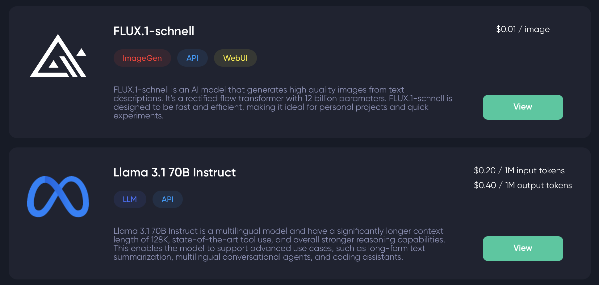
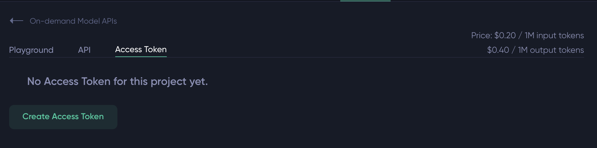

# 2. EdgeCloud Setup Guide

Welcome to **Guide 2** of the Theta AI2NFT Workshop! 🚀

In this guide, you'll set up your Theta EdgeCloud account and configure your development environment to access powerful AI models. By the end of this guide, you'll have everything ready to integrate Llama 3.1 70B for chat functionality and Flux.1-schnell for image generation.

## 🌟 What is Theta EdgeCloud?

**Theta EdgeCloud** is empowering AI teams around the world with unrivaled GPU price-to-performance. Its mission is to provide developers, researchers and enterprises large and small with unlimited access to GPU processing power for any AI, video, rendering, and containerized task, at the most optimal cost.

This approach brings the best of Cloud computing to a decentralized system, powered by the Theta Edge Network. The combined GPU compute power of Theta's decentralized edge network is 20-30x more than other comparable networks in the industry today.

### **🤖 AI Models We'll Use:**
- **Llama 3.1 70B Instruct** - For intelligent conversation handling
- **Flux.1-schnell** - For high-quality image generation

---

## 📝 Step 1: Create Your EdgeCloud Account

### **1.1 Sign Up Process**

1. **Navigate to EdgeCloud**
   - Go to [thetaedgecloud.com](https://thetaedgecloud.com)
   - Click **"Sign Up"** or **"Login"** if you already have an account

2. **Fill Out Registration**
   - Enter your email address
   - Create a secure password

3. **Verify Your Account**
   - Check your email for a verification link

### **1.2 Redeem Workshop Credits**

1. **Navigate to Billing**
   - Once logged in, go to the **"Billing"** section in your dashboard
   - Look for the **"Apply Coupon"** option

2. **Enter Coupon Code**
   - Click **"Apply Coupon"**
   - Enter the provided workshop coupon code
   - Click **"Apply"**

   > 💰 **Workshop Credits**: You should now have approximately **$10 USD in credits** to use for testing during the workshop!

---

## 🔑 Step 2: Understanding API Authentication & Endpoints

### **2.1 Accessing On-Demand Models**

1. **Navigate to On-Demand APIs**
   - In your EdgeCloud dashboard, find **"On-Demand model APIs"**
   - You'll see available models including **Llama 3.1 70B** and **Flux.1-schnell**

   

2. **Explore Model Details**
   - Click **"View"** on any model to see:
     - **Playground** - Test the model interactively
     - **API** - Code examples and endpoints
     - **Access Token** - Your unique API key for authenticating requests

   

### **2.2 Generate Your Access Token**

1. **Create Access Token**
   - Navigate to **"Access Token"** section
   - Click **"Create Access Token"**
   - Give your token a descriptive name (e.g., "AI2NFT Workshop")
   - **Copy and save this token securely**

2. **Authentication Method**
   - EdgeCloud uses **Bearer Token authentication**
   - Your requests will include: `Authorization: Bearer YOUR_TOKEN_HERE`

### **2.3 API Endpoints We'll Use**

#### **Llama 3.1 70B (Chat/LLM)**
```
https://ondemand.thetaedgecloud.com/infer_request/llama_3_1_70b/completions
```

#### **Flux.1-schnell (Image Generation)**
```
https://ondemand.thetaedgecloud.com/infer_request/flux
```

### **2.4 Example API Call**

Here's how a typical API call looks:

```bash
curl -X POST "https://ondemand.thetaedgecloud.com/infer_request/llama_3_1_70b/completions" \
  -H "Content-Type: application/json" \
  -H "Authorization: Bearer $ON_DEMAND_API_ACCESS_TOKEN" \
  --data-raw '{
    "input": {
      "max_tokens": 500,
      "messages": [
        {
          "role": "system",
          "content": "You are a helpful assistant"
        },
        {
          "role": "user",
          "content": "What is Theta Network?"
        }
      ],
      "stream": false,
      "temperature": 0.7,
      "top_p": 0.9
    }
  }'
```

---

## ⚙️ Step 3: Configure Your Development Environment

### **3.1 Set Up Environment Variables**

1. **Navigate to Backend Directory**
   ```bash
   cd backend
   ```

2. **Copy Environment Template**
   ```bash
   cp .env.example .env
   ```

3. **Edit Your .env File**
   Open the `.env` file in your text editor and configure the following variables:

   ```env
   # =============================================
   # EdgeCloud Configuration  
   # =============================================

   # Theta EdgeCloud On-Demand API Token
   ON_DEMAND_API_ACCESS_TOKEN=your-on-demand-api-token-here

   # =============================================
   # LLM (Language Model) Configuration
   # =============================================
   # Theta EdgeCloud LLM API URL
   LLM_URL=https://ondemand.thetaedgecloud.com/infer_request/llama_3_1_70b/completions

   # LLM Parameters (optional - defaults provided)
   TEMPERATURE=0.7
   TOP_P=0.9
   MAX_TOKENS=1000
   ```

4. **Replace Placeholder Values**
   - Replace `YOUR_ACCESS_TOKEN_HERE` with the access token you created in Step 2.2
   - Make sure there are no extra spaces or quotes around the token

### **3.2 Important Security Notes**

⚠️ **Never commit your .env file to version control!**

- The `.env` file should already be in your `.gitignore`
- Your access token is sensitive - treat it like a password
- Don't share your token in screenshots, logs, or public repositories

---

## 🧪 Step 4: Test Your Setup

### **4.1 Install Dependencies**

```bash
# Make sure you're in the backend directory
cd backend

# Install Node.js dependencies
npm install
```

### **4.2 Start the Development Server**

```bash
# Start the backend server
npm run dev
```

You should see output similar to:
```
🚀 AI to NFT Workshop Backend running on http://localhost:4000
📊 Health check available at http://localhost:4000/health
```

### **4.3 Test the Health Endpoint**

Open your browser or use curl to test:

```bash
curl http://localhost:4000/health
```

Expected response:
```json
{
  "status": "ok",
  "timestamp": "2024-01-01T12:00:00.000Z",
  "service": "AI to NFT Workshop Backend"
}
```

### **4.4 Test API Integration**

We'll test the EdgeCloud integration in the next guide, but for now, make sure your server starts without environment variable errors.

---

## ✅ Verification Checklist

Before moving to the next guide, ensure you have:

- [ ] **EdgeCloud Account** - Created and verified
- [ ] **Workshop Credits** - Applied coupon and have ~$12 in credits
- [ ] **Access Token** - Generated and securely saved
- [ ] **Environment Variables** - Configured in your `.env` file
- [ ] **Backend Server** - Starts successfully without errors
- [ ] **Health Check** - Returns successful response

---

## 🔧 Troubleshooting

### **Common Issues:**

#### **"LLM_URL environment variable is not set"**
- Check that your `.env` file is in the `backend/` directory
- Verify there are no typos in variable names
- Ensure no extra spaces around the `=` sign

#### **"Access token invalid" errors**
- Double-check you copied the full token without extra characters
- Try generating a new access token

#### **Server won't start**
- Make sure you're in the `backend/` directory
- Run `npm install` to ensure all dependencies are installed
- Check for any syntax errors in your `.env` file

#### **Out of credits**
- Check your billing dashboard for remaining credits
- Apply the workshop coupon if you haven't already

---

## 🎯 What's Next?

Excellent work! Your EdgeCloud environment is now configured and ready. In the next guide, we'll dive into **Chat Integration** where you'll:

- Implement the LLM integration using Llama 3.1 70B
- Build the chat API endpoints

**Ready to continue?** Let's move on to [**Guide 3: Chat Integration**](./03-chat-integration-guide.md)!