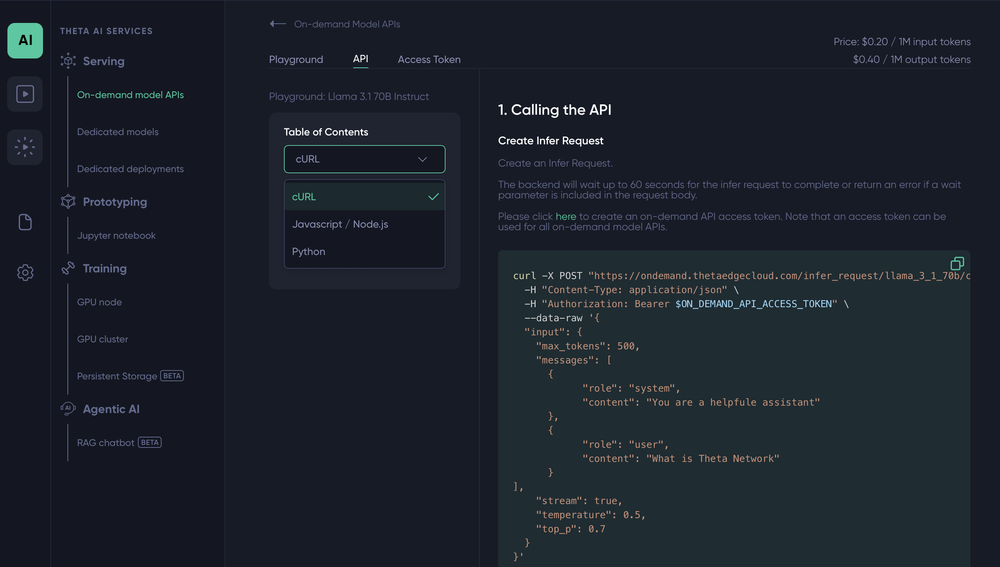

# 3. Chat Integration Guide

Welcome to **Guide 3** of the Theta AI2NFT Workshop! 💬🤖

In this guide, you'll bring your AI assistant to life by integrating Llama 3.1 70B through Theta EdgeCloud. You'll set up the frontend interface, understand the chat flow architecture, and test real conversations with your AI-powered application.

## 🎯 What You'll Accomplish

By the end of this guide, you'll have:
- ✅ **Frontend running** - Complete user interface for chat interactions
- ✅ **LLM integration working** - Real conversations with Llama 3.1 70B
- ✅ **Chat flow understanding** - Know how messages flow through your system

---

## 🚀 Step 1: Set Up the Frontend

### **1.1 Frontend Environment Configuration**

1. **Navigate to Frontend Directory**
   ```bash
   cd frontend
   ```

2. **Create Environment File**
   ```bash
   cp .env.example .env
   ```

3. **Configure Frontend Environment**
   Open the `.env` file in your text editor and set:

   ```env
   # Backend API URL
   REACT_APP_BACKEND_URL=http://localhost:4000
   
   # Disable minting for now (we'll enable this later)
   REACT_APP_IS_MINTING_ACTIVE=false
   ```

   > 💡 **Note**: We're keeping minting disabled for now to focus on chat functionality. We'll enable it in later guides.

### **1.2 Install Frontend Dependencies**

```bash
# Make sure you're in the frontend directory
cd frontend

# Install all React dependencies
npm install
```

### **1.3 Start the Frontend Development Server**

```bash
# Start the React development server
npm start
```

You should see output similar to:
```
Compiled successfully!

You can now view frontend in the browser.

  Local:            http://localhost:3000
  On Your Network:  http://192.168.x.x:3000
```

### **1.4 Verify Both Servers Are Running**

At this point, you should have:
- **Backend Server**: Running on `http://localhost:4000` 
- **Frontend Server**: Running on `http://localhost:3000`

Visit `http://localhost:3000` in your browser - you should see the AI2NFT Workshop interface!

---

## 🧠 Step 2: Understanding the Chat Flow Architecture

Before we test the integration, let's understand how messages flow through your system:

### **2.1 The Complete Flow**

```
User Input → Frontend → Backend → EdgeCloud → Response Chain
    ↓           ↓         ↓          ↓           ↓
  Types      Sends      Routes    Processes   Returns
 message    to /chat   to LLM     with AI     to user
```

### **2.2 Backend Chat Endpoint Analysis**

Let's examine the key components:

#### **Main Chat Handler** (`/chat` endpoint in `server.ts`)

```javascript
app.post('/chat', async (req, res) => {
  try { 
    const body: CompletionInput = req.body;

    // Validate request body
    if (!body.messages || !Array.isArray(body.messages)) {
      return res.status(400).json({ 
        error: 'Invalid request: messages array is required' 
      } as APIError);
    }

    const completionResult = await handleCompletion(body.messages);
    
    // Prepare response with NFT data if available
    const response: APISuccess = {
      success: true,
      result: completionResult,
      latestNFT: body.nft
    };

    res.json(response);
  } catch (error) {
    console.error('Chat endpoint error:', error);
    res.status(500).json({ 
      error: API_RESPONSES.ERRORS.SERVER_ERROR,
      details: error instanceof Error ? error.message : 'Unknown error'
    } as APIError);
  }
});
```

#### **LLM Handler** (`handleCompletion` in `llmHandler.ts`)

```javascript
export async function handleCompletion(messages: Message[]): Promise<LLMResponse> {
  // 1. Validate EdgeCloud configuration
  validateLLMConfig();
  
  // 2. Clean messages for LLM (remove frontend-specific data)
  const cleanMessages = cleanMessagesForLLM(messages);
  
  // 3. Make actual API call to Theta EdgeCloud
  return await makeLLMRequest(cleanMessages);
}
```

### **2.3 🔧 Your Implementation Task: EdgeCloud API Request**

**Open [`backend/src/handlers/llmHandler.ts`](../backend/src/handlers/llmHandler.ts) and complete the `makeLLMRequest` function:**

**Your mission:**
1. **Remove** the hardcoded return statement (lines 51-54)
2. **Implement** the actual API request using the commented steps
3. **Use** the `LLM_CONFIG` constants for configuration values
4. **Follow** the 4-step guide in the code comments

   

> 💡 **Tip:** In ThetaEdgeCloud, when viewing your model, check the **API tab** and select **JavaScript/Node.js** for the exact implementation example.
>
> 🎯 **Your goal:** Make a `fetch()` request to the LLM endpoint with proper headers, body, and error handling!

### **2.4 Message Cleaning Process**

The `cleanMessagesForLLM` function removes frontend-specific data:

```javascript
// Input: Frontend messages (may contain NFT data)
[
  { role: 'user', content: 'Hello!', nft: { image: '...', prompt: '...' } }
]

// Output: Clean messages for EdgeCloud
[
  { role: 'user', content: 'Hello!' }
]
```

---

## 🧪 Step 3: Test Your Chat Integration

### **3.1 Basic Conversation Test**

1. **Open the Frontend**
   - Go to `http://localhost:3000`
   - You should see the AI2NFT Workshop interface

2. **Start a Conversation**
   - Type: `"Hello! How are you?"`
   - Press **Send** or hit **Enter**

3. **Expected Behavior**
   - You should see a typing indicator
   - After a few seconds, you'll get a response from Llama 3.1 70B
   - The conversation should feel natural and intelligent

### **3.2 Test Different Types of Messages**

Try these conversation starters to test various capabilities:

#### **General Knowledge**
```
"What is Theta Network?"
```

#### **Creative Writing**
```
"Write a short poem about blockchain technology"
```

#### **Technical Questions**
```
"Explain how NFTs work in simple terms"
```

#### **Conversational**
```
"I'm building an AI application. Any tips?"
```

### **3.3 Understanding the Response Structure**

When you send a message, here's what happens behind the scenes:

#### **Frontend Request to Backend**
```json
{
  "messages": [
    { "role": "user", "content": "Hello! How are you?" }
  ],
  "nft": { "image": "", "prompt": "", "wallet": "" }
}
```

#### **Backend Request to EdgeCloud**
```json
{
  "input": {
    "max_tokens": 1000,
    "messages": [
      { "role": "user", "content": "Hello! How are you?" }
    ],
    "stream": false,
    "temperature": 0.7,
    "top_p": 0.9
  }
}
```

#### **EdgeCloud Response**
```json
{
  "body": {
    "infer_requests": [{
      "output": {
        "message": "Hello! I'm doing well, thank you for asking. I'm here to help you with..."
      },
      "input": { ... }
    }]
  }
}
```

#### **Frontend Receives**
```json
{
  "success": true,
  "result": {
    "output": {
      "message": "Hello! I'm doing well, thank you for asking..."
    }
  }
}
```

---

## 🎨 Step 4: Customize Your AI Assistant

### **5.1 Adjust LLM Parameters**

You can modify the AI's behavior by changing parameters in your backend `.env`:

```env
# More creative responses (0.0 = deterministic, 1.0 = very creative)
TEMPERATURE=0.8

# Response diversity (0.1 = focused, 1.0 = diverse)
TOP_P=0.9

# Longer responses (but costs more credits)
MAX_TOKENS=1500
```

### **5.2 Understanding Parameters**

- **Temperature**: Controls creativity/randomness
  - `0.1` - Very focused and deterministic
  - `0.7` - Balanced (default)
  - `1.0` - Very creative and unpredictable

- **Top P**: Controls response diversity
  - `0.1` - Very focused vocabulary
  - `0.9` - Balanced (default)
  - `1.0` - Uses full vocabulary

- **Max Tokens**: Controls response length
  - `500` - Short responses
  - `1000` - Medium responses (default)
  - `2000` - Long responses (costs more)

---

## ✅ Verification Checklist

Before moving to the next guide, ensure:

- [ ] **Frontend is running** on `http://localhost:3000`
- [ ] **Backend is running** on `http://localhost:4000`
- [ ] **Chat interface loads** without errors
- [ ] **Messages send successfully** and get responses
- [ ] **LLM responses are intelligent** and contextually appropriate
- [ ] **No console errors** in browser or backend
- [ ] **Conversation history works** (AI remembers previous messages)

---

## 🎯 What's Next?

Excellent work! Your AI assistant is now powered by Theta EdgeCloud's Llama 3.1 70B model. You have a fully functional chat interface that can handle intelligent conversations.

In the next guide, we'll add **Image Generation** capabilities where you'll:

- Integrate Flux.1-schnell for text-to-image generation
- Implement intelligent image request detection
- Handle the complete image generation workflow
- Connect images to the NFT creation process

**Ready for more AI magic?** Let's move on to [**Guide 4: Image Generation**](./04-image-genearation-guide.md)!