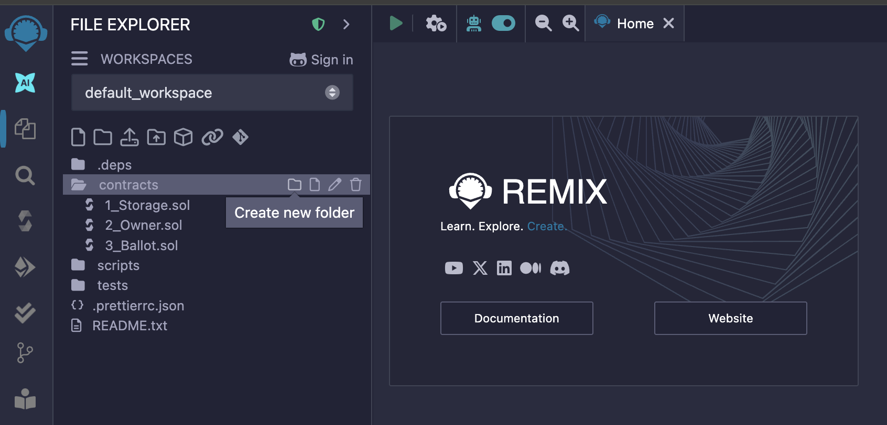
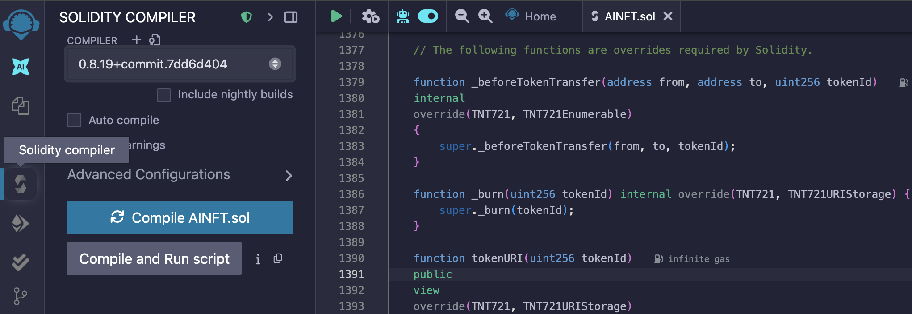
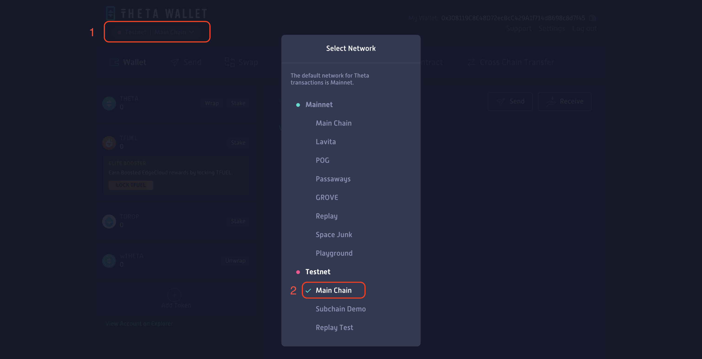
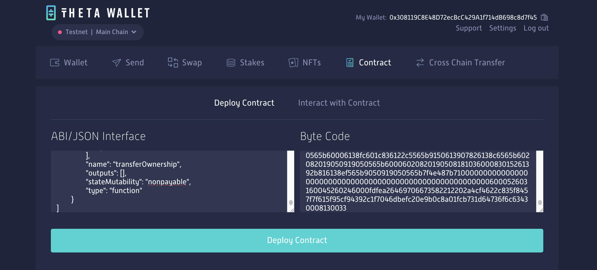
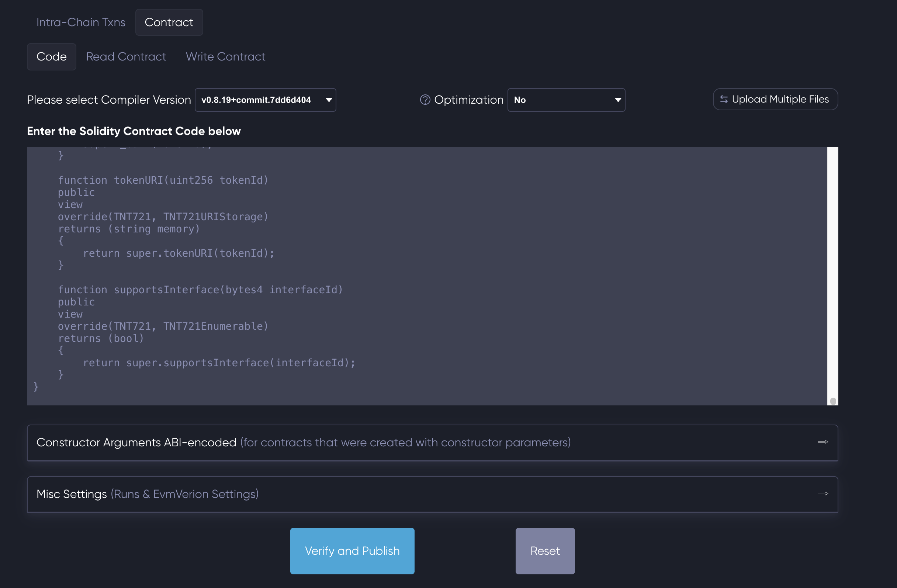

# 5. Smart Contract Development Guide

Welcome to **Guide 5** of the Theta AI2NFT Workshop! ⛓️🔨

In this guide, you'll dive into blockchain development by creating and deploying your very own NFT smart contract on the Theta blockchain. You'll learn Solidity fundamentals, understand NFT standards, and deploy a contract that will power your AI-generated NFT minting system.

## 🎯 What You'll Accomplish

By the end of this guide, you'll have:
- ✅ **Smart Contract** - Understand how blockchain contracts work
- ✅ **NFT Standards Knowledge** - Learn TNT721 (Theta's ERC721) implementation
- ✅ **Solidity Fundamentals** - Write and understand smart contract code
- ✅ **Blockchain Deployment** - Deploy contracts to Theta testnet
- ✅ **Contract Verification** - Verify your contract on Theta Explorer

---

## 🧠 Step 1: Understanding Smart Contracts & NFTs

### **1.1 What Are Smart Contracts?**

**Smart contracts** are programs that run on blockchain networks. Think of them as:
- **Self-executing code** that automatically enforces rules
- **Transparent agreements** visible to everyone on the blockchain
- **Immutable logic** that can't be changed once deployed
- **Trustless systems** that don't require intermediaries

#### **Real-World Analogy**
Imagine a vending machine:
- **Input**: You insert money and select a product
- **Logic**: Machine checks if you paid enough
- **Output**: Dispenses product or returns money
- **No middleman needed!**

Smart contracts work similarly but on the blockchain.

### **1.2 What Are NFTs?**

**NFTs (Non-Fungible Tokens)** are unique digital assets that:
- **Prove ownership** of digital content
- **Cannot be duplicated** - each has a unique ID
- **Are transferable** between wallets
- **Store metadata** linking to images, descriptions, etc.

#### **NFT vs Regular Tokens**
```
Regular Token (e.g., TFUEL):
- Each token = exactly the same
- 1 TFUEL = 1 TFUEL (fungible)

NFT:
- Each token = completely unique  
- Token #1 ≠ Token #2 (non-fungible)
```

### **1.3 Theta Blockchain & TNT721**

**Theta** is an Ethereum-compatible blockchain that:
- **Supports Solidity** - Same programming language as Ethereum
- **Lower fees** - More affordable for development and minting
- **Fast transactions** - Quick confirmation times
- **EVM compatible** - Ethereum tools work on Theta

**TNT721** is Theta's NFT standard:
- **Identical to ERC721** - Same functions and behavior
- **Full compatibility** - Works with existing NFT tools
- **Battle-tested** - Based on OpenZeppelin's proven libraries

---

## 📜 Step 2: Understanding [Our NFT Contract](../contracts/nft-contract.sol)

### **2.1 Contract Architecture**

Our AINFT contract uses a **modular approach** by inheriting from multiple libraries:

```solidity
contract AINFT is TNT721, TNT721Enumerable, TNT721URIStorage, Ownable {
    // Your custom logic here
}
```

#### **Library Breakdown**

| Library | Purpose | Key Features |
|---------|---------|--------------|
| **TNT721** | Core NFT functionality | Mint, transfer, approve tokens |
| **TNT721Enumerable** | Token enumeration | Count tokens, list by owner |
| **TNT721URIStorage** | Metadata management | Unique URI per token |
| **Ownable** | Access control | Restrict functions to owner |

### **2.2 Key Functions Explained**

#### **Constructor**
```solidity
constructor() TNT721("AI NFT", "AINFT") Ownable() {}
```
- **Sets collection name**: "AI NFT"
- **Sets symbol**: "AINFT" (like a ticker symbol)
- **Establishes ownership**: Deployer becomes owner

#### **Safe Minting Function**
```solidity
function safeMint(address to, string memory uri) external onlyOwner {
    uint tokenId = totalSupply() + 1;
    _safeMint(to, tokenId);
    _setTokenURI(tokenId, uri);
}
```

**Line-by-line breakdown**:
1. `external onlyOwner` - Only contract owner can call this
2. `uint tokenId = totalSupply() + 1` - Generate unique token ID
3. `_safeMint(to, tokenId)` - Create token and assign to address
4. `_setTokenURI(tokenId, uri)` - Set metadata URI for token

#### **Override Functions**
The contract includes several override functions required by Solidity:
- **Resolve inheritance conflicts** between multiple parent contracts
- **Ensure proper functionality** when multiple libraries are used
- **Maintain compatibility** with NFT standards

### **2.3 Why This Architecture?**

#### **Security Benefits**
- **OpenZeppelin libraries** - Audited and battle-tested code
- **Access control** - Only owner can mint (prevents unauthorized minting)
- **Safe transfers** - Built-in checks prevent lost tokens

#### **Functionality Benefits**
- **Enumerable** - Can list all tokens owned by an address
- **URI storage** - Each token can have unique metadata
- **Standard compliance** - Works with all NFT marketplaces

#### **Scalability Benefits**
- **Efficient storage** - Optimized gas usage
- **Extensible design** - Easy to add features later
- **Interoperability** - Compatible with existing tools

---

## 🔧 Step 3: Contract Compilation with Remix

### **3.1 Why Use Remix?**

**Remix IDE** is perfect for smart contract development because:
- **Browser-based** - No installation required
- **Built-in compiler** - Compiles Solidity automatically
- **Error checking** - Shows compilation errors in real-time
- **Testing tools** - Built-in deployment and testing
- **Free to use** - No setup costs

### **3.2 Setting Up Your Contract**

#### **Step 3.2.1: Access Remix**
1. **Open Remix**: Go to [remix.ethereum.org](https://remix.ethereum.org/)
2. **Familiarize yourself** with the interface:
   - **File Explorer** (left): Manage contract files
   - **Editor** (center): Write your code
   - **Terminal** (bottom): See compilation results

#### **Step 3.2.2: Create Contract File**
1. **Click "Create New File"** in the File Explorer

   

2. **Name your file**: `AINFT.sol`
3. **Copy the complete contract code** from [`contracts/nft-contract.sol`](../contracts/nft-contract.sol)
4. **Paste it** into your new file

### **3.3 Compilation Process**

#### **Step 3.3.1: Configure Compiler**
1. **Go to Solidity Compiler tab** (left sidebar)
2. **Set compiler version**: `0.8.19`
   - **Why this version?** It's stable and widely supported
   - **Compatibility**: Works well with OpenZeppelin libraries
3. **Leave optimization OFF** for now (easier debugging and verification in explorer)

#### **Step 3.3.2: Compile Contract**
1. **Click "Compile AINFT.sol"**

   

2. **Check for success**:
   - ✅ **Green checkmark** = Compilation successful
   - ❌ **Red X** = Compilation failed (check errors in terminal)

#### **Step 3.3.3: Extract Deployment Data**
After successful compilation:
1. **Select "AINFT"** from the contract dropdown
2. **Copy the ABI** (Application Binary Interface):
   - **What is ABI?** - Interface that tells other programs how to interact with your contract
3. **Copy the Bytecode**:
   - **What is Bytecode?** - The compiled contract code that runs on the blockchain

**💡 Pro Tip**: Save both ABI and Bytecode in separate text files - you'll need them for deployment!

### **3.4 Understanding Compilation Output**

#### **What Happens During Compilation**
```
Solidity Code → Compiler → Bytecode + ABI
     ↓              ↓           ↓
Human readable → Process → Machine code + Interface
```

#### **Common Compilation Issues**

| Error Type | Common Cause | Solution |
|------------|--------------|----------|
| **Syntax Error** | Missing semicolon, bracket | Check syntax carefully |
| **Version Mismatch** | Wrong Solidity version | Use version 0.8.19 |
| **Import Issues** | Missing dependencies | Use the flattened contract |

---

## 🌐 Step 4: Wallet Setup & Testnet Configuration

### **4.1 Why Theta Web Wallet?**

**Theta Web Wallet** is the official wallet that:
- **Native Theta support** - Built specifically for Theta blockchain
- **Contract deployment** - Built-in deployment tools
- **Testnet access** - Easy switching between mainnet/testnet
- **Faucet integration** - Get free testnet tokens instantly

### **4.2 Creating Your Wallet**

#### **Step 4.2.1: Wallet Creation**
1. **Go to** [wallet.thetatoken.org](https://wallet.thetatoken.org)
2. **Click "Create Wallet"**
3. **Follow the setup process**:
   - **Generate seed phrase** - Write this down and store securely!
   - **Download keystore file** - Save this file safely
   - **Set a strong password** - You'll need this often

#### **Step 4.2.2: Security Best Practices**
- **Never share your seed phrase** - Anyone with it controls your wallet
- **Backup your keystore file** - Store in multiple secure locations
- **Use a strong password** - Your keystore encryption depends on it
- **Test with small amounts** - Always verify everything works first

#### **Step 4.2.3: Unlock Your Wallet**
1. **Upload your keystore file**
2. **Enter your password**
3. **Access your wallet dashboard**

### **4.3 Switching to Testnet**

#### **Step 4.3.1: Network Selection**
1. **Click the network selector** at the top left (shows "Mainnet | Main Chain")
2. **Select "Testnet | Main Chain"**

   

3. **Confirm the switch** - Interface should now show "Testnet"

#### **Step 4.3.2: Understanding Testnets**
**Testnets** are identical copies of the main blockchain but:
- **Free tokens** - Get test TFUEL for free
- **Safe experimentation** - Mistakes don't cost real money
- **Same functionality** - Everything works like mainnet
- **No real value** - Test tokens have no monetary worth

### **4.4 Getting Testnet TFUEL**

#### **Step 4.4.1: Using the Faucet**
1. **Click "Receive"** in your wallet
2. **Click "Faucet"**
3. **Wait for confirmation** - Should receive testnet TFUEL in ~20 seconds
4. **Verify balance** - Check that your balance increased

#### **Step 4.4.2: Why You Need TFUEL**
- **Gas fees** - Every blockchain operation costs gas
- **Contract deployment** - Deploying contracts requires gas
- **Future transactions** - Minting NFTs will also need gas

**💡 Gas Costs on Theta:**
- **Contract deployment**: ~16 TFUEL
- **NFT minting**: ~1-3 TFUEL per mint
- **Very affordable** compared to Ethereum!

---

## 🚀 Step 5: Smart Contract Deployment

### **5.1 Understanding Contract Deployment**

When you deploy a contract:
1. **Bytecode is sent** to the blockchain
2. **Contract gets an address** (like 0x742d35Cc6aB...)
3. **Code becomes immutable** - can't be changed
4. **Contract is publicly accessible** - anyone can interact with it

### **5.2 Deployment Process**

#### **Step 5.2.1: Navigate to Contract Tab**
1. **In Theta Web Wallet**, click the **"Contract"** tab in the top navigation
2. **You'll see deployment form** with fields for ABI and Bytecode

#### **Step 5.2.2: Input Contract Data**
1. **Paste ABI** from Remix into the "ABI" field
2. **Paste Bytecode** from Remix into the "Bytecode" field

   

3. **Review the information**:
   - **Constructor parameters**: None needed for our contract
   - **Gas limit**: Will be estimated automatically

#### **Step 5.2.3: Deploy Contract**
1. **Click "Deploy Contract"**
2. **Wait for transaction confirmation** (~5-10 seconds)
3. **Save your contract address** - You'll see it displayed at the top

**🎉 Congratulations!** Your smart contract is now live on the Theta testnet!

### **5.3 Testing Your Deployment**

#### **Step 5.3.1: Basic Function Test**
1. **Select a read function** (e.g., "owner")
2. **Click "Read"**
3. **Verify result** - Should return your wallet address

#### **Step 5.3.2: Understanding Contract State**
Your newly deployed contract:
- **Has 0 NFTs** - Nothing minted yet
- **You are the owner** - Only you can mint
- **Is ready for minting** - All functions available

---

## 🔍 Step 6: Contract Verification

### **6.1 Why Verify Your Contract?**

**Contract verification** makes your contract:
- **Transparent** - Anyone can read the source code
- **Trustworthy** - People can verify what the contract does
- **Interoperable** - Block explorers can decode function calls
- **Professional** - Shows you follow best practices

### **6.2 Theta Explorer Verification**

#### **Step 6.2.1: Access Theta Explorer**
1. **Go to** [testnet-explorer.thetatoken.org](https://testnet-explorer.thetatoken.org)
2. **Search for your contract address**
3. **Click on your contract** in the search results

#### **Step 6.2.2: Navigate to Verification**
1. **Click the "Contract" tab**
2. **You'll see verification form** if contract isn't verified yet

#### **Step 6.2.3: Fill Verification Form**
1. **Compiler version**: `v0.8.19`
2. **Optimization**: `No`
3. **Solidity Source Code**: Copy the complete code from [`contracts/nft-contract.sol`](../contracts/nft-contract.sol)
4. **Leave other fields** as default

   

#### **Step 6.2.4: Submit Verification**
1. **Click "Verify and Publish"**
2. **Wait for processing** (~30 seconds)
3. **Check for success message**

✅ **Success!** Your contract is now verified and publicly viewable.

### **6.3 Exploring Your Verified Contract**

After verification, you can:
- **Read contract code** directly in the explorer
- **See function calls** in transaction details
- **View contract events** and logs
- **Interact with contract** through the explorer interface

---

## 🧪 Step 7: Testing & Validation

### **7.1 Contract Function Testing**

#### **Test Read Functions**
In Theta Explorer or Web Wallet, test these functions:

```solidity
// Should return your wallet address
owner()

// Should return "AI NFT"  
name()

// Should return "AINFT"
symbol()

// Should return 0 (no tokens minted yet)
totalSupply()
```

#### **Understanding Function Results**
- **owner()**: Confirms you control the contract
- **name() & symbol()**: Verifies contract metadata
- **totalSupply()**: Shows current NFT count (should be 0)

---

## 🔧 Step 8: Troubleshooting Common Issues

### **8.1 Compilation Errors**

#### **"Compiler version mismatch"**
**Solution**: Ensure you're using Solidity 0.8.19 in Remix

#### **"Import resolution failed"**
**Solution**: Use the flattened contract from the repository - it includes all dependencies

#### **"Syntax error"**
**Solution**: 
- Check for missing semicolons
- Verify all brackets are closed
- Ensure proper indentation

### **8.2 Deployment Issues**

#### **"Insufficient gas"**
**Solution**: 
- Get more testnet TFUEL from the faucet
- Wait for previous transactions to confirm

#### **"Transaction failed"**
**Solution**:
- Check network connection
- Verify you're on Theta testnet

#### **"Contract deployment failed"**
**Solution**:
- Verify ABI and bytecode are complete
- Check for compilation errors first
- Try deploying again after a few minutes

### **8.3 Verification Problems**

#### **"Verification failed"**
**Solution**:
- Double-check compiler version (0.8.19)
- Ensure optimization is set to "No"
- Copy the exact source code from the repository
- Make sure contract address is correct

#### **"Source code mismatch"**
**Solution**:
- Use the flattened contract file
- Don't modify the code before verification
- Ensure you're using the same compiler settings

---

## ✅ Verification Checklist

Before proceeding to NFT minting, ensure all these items are complete:

- [ ] **Contract compiled in Remix** – No errors, correct Solidity version (0.8.19)
- [ ] **Theta Web Wallet created & secured** – Wallet backed up and accessible
- [ ] **Testnet TFUEL received** – Faucet used, balance confirmed
- [ ] **Contract deployed to Theta testnet** – Deployment transaction successful
- [ ] **Contract visible on Theta Explorer** – Can view contract address and details
- [ ] **Contract verified on Theta Explorer** – Source code published and verified

---

## 🎯 What's Next?

Excellent work! You've successfully deployed and verified your NFT smart contract on the Theta blockchain. Your contract is now ready to mint AI-generated artwork as NFTs.

In the next guide, you'll learn how to:

- **Connect your backend** to the deployed smart contract
- **Implement automated minting** using ethers.js
- **Create NFT metadata** with image URLs and descriptions  
- **Handle minting transactions** with proper error handling

**Ready to mint your first AI NFT?** Let's move on to [**Guide 6: NFT Minting Integration**](./06-nft-minting-guide.md)!

---

> 💡 **Pro Tip**: Keep your contract address handy - you'll need it in the next guide to connect your backend.

> 🔐 **Security Reminder**: Your contract is now live on the blockchain! While it's on testnet (no real value), always treat smart contracts with respect. In production, never share private keys or deploy without thorough testing.

