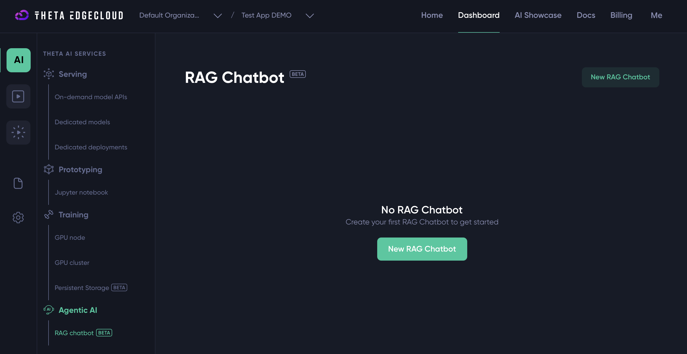
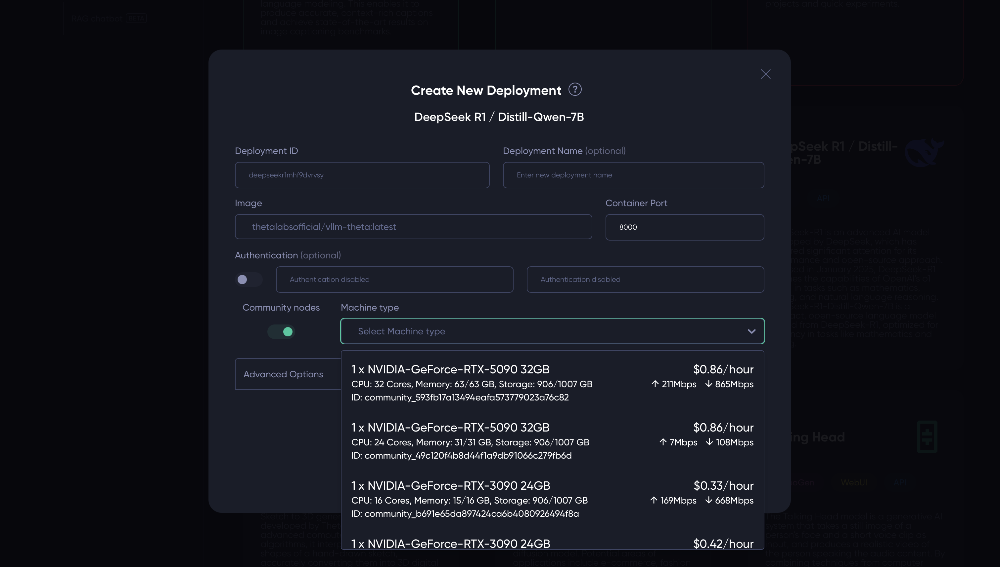

# 🚀 Guide 7: Advanced AI Features & Customization

**Congratulations!** You've built a complete AI2NFT pipeline. Now let's explore advanced AI capabilities that will take your platform to the next level.

## 🎯 **What You'll Learn**

- **🎨 Prompt Engineering Mastery** - Advanced techniques for consistent, high-quality image generation
- **🧠 RAG Chat Integration** - Knowledge-based AI with Retrieval-Augmented Generation
- **🖥️ Community Node Deployment** - Deploy DeepSeek on decentralized infrastructure 
- **🎭 Creative Extensions** - Unique features to differentiate your platform

---

## 🎨 Chapter 1: Advanced Prompt Engineering & Styling

### **1.1 Understanding Current Prompts**

Your AI2NFT system uses carefully crafted prompts in [`constants.ts`](../backend/src/constants.ts). Let's enhance them for better results.

#### **Current Image Generation Check Prompt**
```javascript
IMAGE_GENERATION_CHECK: JSON.stringify(`
Your task is to determine whether the user is asking for an image to be generated...
If the user is requesting or implying that they want an image, return:
{
  "generate": true,
  "prompt": "<short clear prompt to generate the image>"
}
`)
```

### **1.2 🔧 Your Enhancement Challenge: Advanced Prompt Styling**

**Open [`backend/src/constants.ts`](../backend/src/constants.ts) and enhance the `IMAGE_GENERATION_CHECK` prompt:**

**Your mission:**
1. **Add automatic styling** to all generated image prompts
2. **Implement style consistency** across your platform
3. **Create unique branding** through consistent visual aesthetics
4. **Test different artistic styles** to find your signature look

**Style Examples to Try:**
```javascript
// Option 1: Photography Styles
"prompt": "<short clear prompt>, professional photography, 85mm lens, soft lighting"

// Option 2: Artistic Styles  
"prompt": "<short clear prompt>, watercolor painting style, soft brush strokes"

// Option 3: Digital Art Styles
"prompt": "<short clear prompt>, digital art, vibrant colors, high contrast"

// Option 4: Vintage Aesthetics
"prompt": "<short clear prompt>, vintage 1970s aesthetic, warm tones, film grain"

// Option 5: Minimalist Design
"prompt": "<short clear prompt>, minimalist design, clean lines, negative space"
```

#### **Advanced Prompt Engineering Techniques**

**1. Quality Enhancers:**
- `"high quality, 4k, detailed"`
- `"masterpiece, award winning"`
- `"professional photography"`

**2. Style Modifiers:**
- `"in the style of [artist/movement]"`
- `"[medium] art style (oil painting, watercolor, digital art)"`
- `"[aesthetic] aesthetic (cyberpunk, vintage, minimalist)"`

**3. Technical Parameters:**
- `"dramatic lighting, soft shadows"`
- `"vibrant colors"` or `"muted colors"`
- `"sharp focus, depth of field"`

> 💡 **Pro Tip:** Create 3-5 different style presets and rotate them, or let users choose their preferred style!

### **1.3 Testing Your Enhanced Prompts**

After updating your prompts:

1. **Restart your backend** - `npm run dev`
2. **Test image generation** - Ask for various images
3. **Compare results** - Notice the consistent styling
4. **Iterate and refine** - Adjust based on generated quality

---

## 🧠 Chapter 2: RAG Chat API Integration

### **2.1 What is RAG (Retrieval-Augmented Generation)?**

**RAG combines:**
- **Large Language Models** - General AI intelligence
- **Knowledge Base** - Your specific domain information
- **Real-time Retrieval** - Fetch relevant context for each query

**Perfect for your AI2NFT platform because:**
- Answer questions about your specific NFT collection
- Provide project roadmap information
- Explain your platform's unique features
- Offer personalized recommendations

### **2.2 Setting Up Your RAG Bot on Theta EdgeCloud**

#### **Step 1: Navigate to RAG Services**
1. Go to [ThetaEdgeCloud.com](https://thetaedgecloud.com)
2. Navigate to **"Theta AI Services"**
3. Select **"RAG Chatbot"**

#### **Step 2: Create New RAG Chatbot**
1. Click **"New RAG Chatbot"**

   

2. **Configure your settings:**
   - **Model Selection**: Choose from EdgeCloud models or external APIs (OpenAI GPT-4, Claude 3.5 Sonnet)
   - **Knowledge Base**: Upload your project documentation
   - **Chat Settings**: Configure response length, temperature, etc.

#### **Step 3: Upload Your Knowledge Base**

**Create knowledge documents about your NFT project:**

**Example: `nft-project-info.txt`**
```
Our AI2NFT Platform

Project Overview:
This platform combines AI image generation with blockchain NFT minting. Users can chat with an AI assistant to generate unique images, which are then automatically minted as NFTs on the Theta blockchain.

Key Features:
- AI-powered image generation using Flux.1-schnell
- Automatic NFT minting with custom metadata
- Theta blockchain integration for low gas fees
- User-friendly chat interface

Technical Stack:
- Frontend: React + TypeScript
- Backend: Node.js + Express
- AI: Theta EdgeCloud (Llama 3.1 70B + Flux.1-schnell)
- Blockchain: Theta Network, Smart Contracts (Solidity)

How to Use:
1. Connect your Theta wallet
2. Chat with the AI assistant
3. Request image generation (e.g., "draw me a sunset")
4. Mint the generated image as an NFT
5. View your NFT on Theta Explorer

Supported Wallet Types:
- Theta Web Wallet
- MetaMask (configured for Theta)
- Any Ethereum-compatible wallet

Gas Costs:
- Minting: ~0.001 TFUEL per NFT
- Very affordable compared to Ethereum mainnet

Troubleshooting:
- If minting fails, check wallet balance
- Ensure wallet is configured for Theta Testnet
- Verify environment variables are set correctly
```

**Upload this knowledge base** to your RAG chatbot.

### **2.3 🔧 Your Implementation Challenge: RAG Integration**

**Your mission:**
1. **Get your RAG API endpoint** from Theta EdgeCloud
2. **Add RAG authentication** to environment variables
3. **Modify LLM handler** to use RAG instead of standard LLM
4. **Test knowledge-based responses**

#### **Step 1: Environment Configuration**

Add to your `.env` file:
```bash
# RAG Chatbot Configuration
RAG_API_URL=https://ai.thetaedgecloud.com/api/v1/chatbot/YOUR_CHATBOT_ID/chat/completions
RAG_AUTH_TOKEN=your_rag_auth_token_here

# Toggle between RAG and standard LLM
USE_RAG_CHAT=true
```

#### **Step 2: Update Constants**

**Open [`backend/src/constants.ts`](../backend/src/constants.ts) and add RAG configuration:**

```javascript
export const RAG_CONFIG = {
  get URL() { return process.env.RAG_API_URL; },
  get AUTH_TOKEN() { return process.env.RAG_AUTH_TOKEN; },
  get USE_RAG() { return process.env.USE_RAG_CHAT === 'true'; },
  MAX_TOKENS: 250,
  TEMPERATURE: 0.5,
  STREAM: false, // Set to true for streaming responses
} as const;
```

#### **Step 3: Enhance LLM Handler**

**Open [`backend/src/handlers/llmHandler.ts`](../backend/src/handlers/llmHandler.ts) and add RAG support:**

**Your implementation challenge:**
```javascript
/**
 * Makes a request to either RAG API or standard LLM based on configuration
 * @param messages - Clean messages to send to the AI
 * @returns Promise resolving to the AI response
 */
async function makeLLMRequest(messages: CleanMessage[]): Promise<LLMResponse> {
  try {
    // TODO: Check if RAG is enabled and route accordingly
    if (RAG_CONFIG.USE_RAG) {
      // TODO: Implement RAG API call
      // Use RAG_CONFIG.URL, RAG_CONFIG.AUTH_TOKEN
      // Format: messages with "developer" role for system, "user" for user
    } else {
      // TODO: Use existing standard LLM logic
    }
  } catch (error) {
    console.error('Error calling AI API:', error);
    throw error;
  }
}
```

**RAG API Request Format:**
```javascript
const response = await fetch(RAG_CONFIG.URL, {
  method: 'POST',
  headers: {
    'Content-Type': 'application/json',
    'Authorization': `Bearer ${RAG_CONFIG.AUTH_TOKEN}`
  },
  body: JSON.stringify({
    messages: [
      {"role": "developer", "content": "You are a helpful assistant with knowledge about our NFT platform."},
      ...messages // Convert to RAG format
    ],
    max_tokens: RAG_CONFIG.MAX_TOKENS,
    temperature: RAG_CONFIG.TEMPERATURE,
    stream: RAG_CONFIG.STREAM
  })
});
```

### **2.4 Testing Your RAG Integration**

**Test these knowledge-based queries:**
- *"How do I mint an NFT on your platform?"*
- *"What are the gas costs for minting?"*
- *"What blockchain do you use?"*
- *"How do I troubleshoot minting failures?"*

**Compare responses:**
- **Without RAG**: Generic AI responses
- **With RAG**: Specific, accurate information about your platform

---

## 🖥️ Chapter 3: Community Node Deployment

### **3.1 What are Community Nodes?**

**Community Nodes** are decentralized GPU nodes operated by Theta Network community members. They offer:

- **Cost-effective hosting** - Often cheaper than centralized cloud providers
- **Decentralized infrastructure** - No single point of failure
- **High-performance GPUs** - RTX 30/40 series for powerful AI inference
- **Dedicated resources** - Your own private model deployment
- **Global distribution** - Nodes worldwide for lower latency

### **3.2 Why Deploy DeepSeek on Community Nodes?**

**DeepSeek Distill-Qwen-7B** is a powerful and efficient model perfect for:
- **Advanced reasoning** - Better problem-solving capabilities
- **Code generation** - Enhanced programming assistance  
- **Cost optimization** - Smaller models with excellent performance
- **Private deployment** - Your own dedicated instance

### **3.3 🔧 Your Implementation Challenge: Deploy DeepSeek**

#### **Step 1: Access Dedicated Deployments**

1. **Navigate to Theta EdgeCloud dashboard**
2. **Go to "Dedicated Deployments"** section
3. **Click "New Deployment"**

   

#### **Step 2: Choose Your Model**

**Select the model:**
- **DeepSeek R1 / Distill-Qwen-7B** - Efficient 7B parameter model, great performance/cost ratio

#### **Step 3: Select Community Node**

**Filter by GPU requirements:**
- **RTX 4090** - Highest performance, premium pricing
- **RTX 4080/4070** - Excellent performance, good value
- **RTX 3090/3080** - Strong performance, budget-friendly

**Consider node factors:**
- **Pricing** - Compare hourly rates
- **Specs** - GPU, connection speed ...

### **3.4 Integration with Your AI2NFT Platform**

#### **Step 1: Update Environment Variables**

Add to your `.env` file:
```bash
# Community Node Deployment
DEEPSEEK_ENDPOINT=https://your-deployment-id.edge-deploy.com/v1/completions

# Toggle between different LLM providers
USE_COMMUNITY_NODE=true
```

#### **Step 2: Modify LLM Handler**

**Enhance your `llmHandler.ts` to support community node:**

```javascript
// Add to constants.ts
export const COMMUNITY_NODE_CONFIG = {
  get ENDPOINT() { return process.env.DEEPSEEK_ENDPOINT; },
  get API_KEY() { return process.env.DEEPSEEK_API_KEY; },
  get USE_COMMUNITY_NODE() { return process.env.USE_COMMUNITY_NODE === 'true'; },
} as const;

// Update makeLLMRequest function
async function makeLLMRequest(messages: CleanMessage[]): Promise<LLMResponse> {
  try {
    let endpoint, headers;
    
    if (COMMUNITY_NODE_CONFIG.USE_COMMUNITY_NODE) {
      // Use Community Node Deployment
      endpoint = COMMUNITY_NODE_CONFIG.ENDPOINT;
      headers = {
        'Content-Type': 'application/json',
        'Authorization': `Bearer ${COMMUNITY_NODE_CONFIG.API_KEY}` // if authentication is set at deployment
      };
    } else if (RAG_CONFIG.USE_RAG) {
      // Use RAG API
      endpoint = RAG_CONFIG.URL;
      headers = {
        'Content-Type': 'application/json',
        'Authorization': `Bearer ${RAG_CONFIG.AUTH_TOKEN}`
      };
    } else {
      // Use standard EdgeCloud
      endpoint = LLM_CONFIG.URL;
      headers = {
        'Content-Type': 'application/json',
        'Authorization': `Bearer ${LLM_CONFIG.API_KEY}`
      };
    }

    const response = await fetch(endpoint, {
      method: 'POST',
      headers,
      body: JSON.stringify({
        messages,
        max_tokens: 1000,
        temperature: 0.7
      })
    });

    // Handle response...
  } catch (error) {
    console.error('Error calling LLM API:', error);
    throw error;
  }
}
```

### **3.5 Testing Your Community Node Deployment**

#### **Performance Testing**
Test these scenarios to compare performance:

```javascript
// Test advanced reasoning
"Solve this logic puzzle: If all roses are flowers, and some flowers fade quickly, can we conclude that some roses fade quickly?"

// Test code generation  
"Write a Python function to calculate fibonacci numbers with memoization"

// Test creative tasks
"Write a haiku about decentralized AI"
```

#### **Compare Results**
- **EdgeCloud On-Demand**: Shared resources, consistent performance
- **Community Node**: Dedicated resources, potentially faster responses
- **Cost Analysis**: Monitor usage costs across different deployments

### **3.6 Advanced Community Node Features**

#### **Docker Container Deployment**
For ultimate customization, you can deploy your own Docker containers:


---

## 🎭 Chapter 4: Improve NFTs

### **4.1 Add Decentralized Storage**

Improve permanence of your NFTs by uploading the images and metadata to IPFS or Arweave.

**Why Decentralized Storage?**
- **Permanence**: Images stored forever, not dependent on centralized servers
- **Decentralization**: No single point of failure
- **Industry Standard**: Most professional NFT projects use IPFS/Arweave
- **Trustless**: Buyers know their NFTs will always be accessible

> 💡 **Tip:** Start with IPFS for easier integration, then consider Arweave for permanent storage in production.

### **4.2 Multi-Style Generation**

**Let users choose their preferred art style:**

```javascript
// Add to constants.ts
export const ART_STYLES = {
  PHOTOGRAPHIC: "professional photography, 85mm lens, natural lighting",
  DIGITAL_ART: "digital art, vibrant colors, sharp details",
  WATERCOLOR: "watercolor painting, soft brush strokes, flowing colors",
  VINTAGE: "vintage aesthetic, retro colors, film grain texture",
  MINIMALIST: "minimalist design, clean lines, negative space",
  CYBERPUNK: "cyberpunk aesthetic, neon colors, futuristic elements"
} as const;
```

### **4.3 NFT Collections & Series**

**Create themed NFT collections:**

```javascript
// Enhanced metadata with collection info
function generateMetadata(nft: NFTInterface, collectionTheme?: string): string {
  const metadata = {
    name: `AI Generated ${collectionTheme || 'Artwork'} #${Date.now()}`,
    description: `${nft.prompt} - Part of the ${collectionTheme || 'AI2NFT'} collection`,
    image: nft.image,
    attributes: [
      {
        trait_type: "Generation Method",
        value: "AI Generated"
      },
      {
        trait_type: "Style",
        value: collectionTheme || "Mixed"
      },
      {
        trait_type: "Created",
        value: new Date().toISOString().split('T')[0]
      }
    ]
  };
  
  const encoded = Buffer.from(JSON.stringify(metadata)).toString("base64");
  return `data:application/json;base64,${encoded}`;
}
```

---

## 🎉 Congratulations!

You've completed the **AI2NFT Workshop** and built a production-ready platform that combines:

✅ **AI-Powered Image Generation** with Flux.1-schnell  
✅ **Intelligent Chat Interface** with Llama 3.1 70B  
✅ **Blockchain NFT Minting** on Theta Network  
✅ **Advanced RAG Integration** for knowledge-based responses  

## 🚀 **What's Next?**

**Continue Building:**
- **Add user authentication** and personal galleries
- **Implement NFT marketplace** features
- **Create mobile app** versions
- **Build community features** and social aspects
- **Explore other AI models** and capabilities

**Join the Community:**
- Share your project on social media
- Contribute to open-source AI/blockchain projects
- Join [Theta community](https://discord.gg/PNWZ8zfyRu)
- Join our hackathon [https://theta-euro.com/block-jam/](https://theta-euro.com/block-jam/)

---

## 📚 **Additional Resources**

- **[Theta Documentation](https://docs.thetatoken.org/)**
- **[ethers.js Documentation](https://docs.ethers.org/)**
- **[React Best Practices](https://react.dev/)**
- **[Node.js Production Guide](https://nodejs.org/en/docs/guides/)**
- **[Smart Contract Security](https://consensys.github.io/smart-contract-best-practices/)**

---

**🎨 You've built something amazing!** Your AI2NFT platform showcases the cutting-edge intersection of artificial intelligence and blockchain technology. Keep building, keep innovating, and keep pushing the boundaries of what's possible! ✨

*Thank you for completing the Theta AI2NFT Workshop!* 🙏